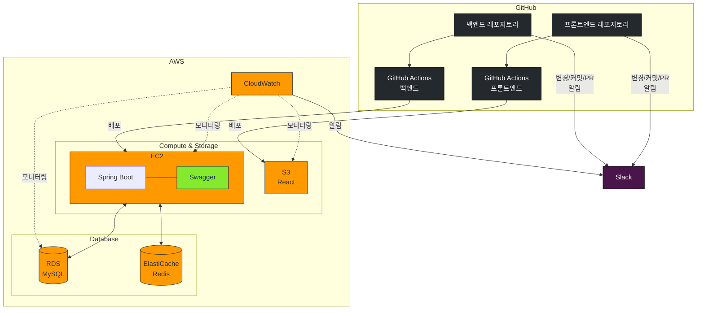

# moya


## 기술 스택


| 분야 | 기술 스택 |
|:---|:---|
| 백엔드 |   |
| 데이터베이스 |   |
| ORM |   |
| 보안 |  |
| 인프라 |    |
| 모니터링 |   |
| 테스트 |    |
| 백업 |  |
| CI/CD |  |
| 협업 툴 |    |
| API 문서화 |  |


## 개발서버 아키텍처



## 개발서버 아키텍처(최신)

```mermaid
flowchart LR
    subgraph Internet["인터넷"]
        D[가비아 도메인]
        DDNS[Duck DDNS]
        GH[GitHub]
        
        subgraph AWS["AWS"]
            S3_BACKUP[(S3 백업)]
            S3_FRONT[(S3 프론트엔드)]
            CF[CloudFront]
        end
    end
    
    subgraph Network["네트워크 장비"]
        NS[NAT 스위치]
        R[공유기]
    end
    
    subgraph HomeServer["홈서버"]
        direction TB
        
        subgraph Docker["Docker Environment"]
            NGINX[엔진엑스]
            
            subgraph APIContainer["API 컨테이너"]
                SB[스프링부트]
                SW[Swagger UI]
                SB --- SW
            end
            
            subgraph DBContainer["Database 컨테이너"]
                RD[(Redis)]
                MS[(MySQL)]
            end
            
            subgraph Monitoring["모니터링"]
                PR[Prometheus]
                GF[Grafana]
                LK[Loki]
                
                PR --> GF
                LK --> GF
            end
            
            NGINX --> SB
            SB --> RD
            SB --> MS
            
            SB -- 메트릭 수집 --> PR
            SB -- 로그 수집 --> LK
            MS -- 메트릭 수집 --> PR
            RD -- 메트릭 수집 --> PR
            NGINX -- 로그 수집 --> LK
        end
        
        IP[IP 감지 스크립트]
        BACKUP[백업 스크립트]
        
        IP -. 5분마다 외부 IP 업데이트 .-> DDNS
        BACKUP -. 자동 백업 .-> S3_BACKUP
    end
    
    D --> CF
    D --> DDNS
    DDNS --> NS
    NS --> R
    R --> NGINX
    
    GH --> |Backend CI/CD| APIContainer
    GH --> |Frontend CI/CD| S3_FRONT
    
    S3_FRONT --> CF
    
    RD -. 백업 .-> BACKUP
    MS -. 백업 .-> BACKUP
    
    style HomeServer fill:#f5f5f5,stroke:#333,stroke-width:2px
    style Internet fill:#e6f3ff,stroke:#333,stroke-width:2px
    style Network fill:#fff5e6,stroke:#333,stroke-width:2px
    style Docker fill:#e6ffef,stroke:#333,stroke-width:2px
    style AWS fill:#fce8d6,stroke:#333,stroke-width:2px
    style Monitoring fill:#f0e6ff,stroke:#333,stroke-width:2px
    
    classDef database fill:#f9f,stroke:#333,stroke-width:2px
    class RD,MS,S3_BACKUP,S3_FRONT database
    
    classDef container fill:#e6fff2,stroke:#333,stroke-width:2px
    class APIContainer,DBContainer container
    
    classDef monitoring fill:#f0e6ff,stroke:#333,stroke-width:2px
    class PR,GF,LK monitoring


    


